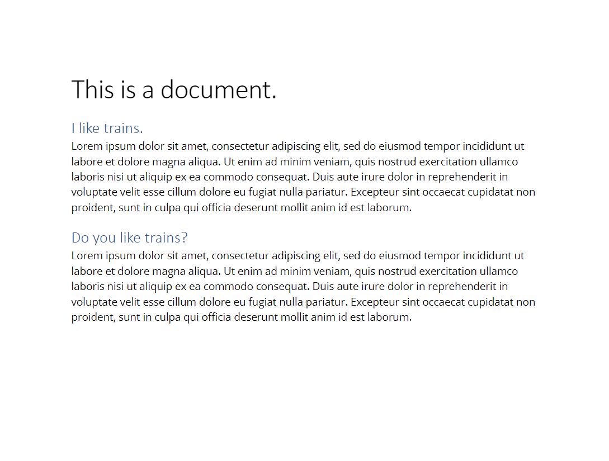

# pdfparser
A small library for parsing text PDFs in hierarchical format (see annex for example).

The parser will return hierarchized data in JSON format with the positioning and style in the original pdf.
A small server has also been included for easier testing and trying the library out.

[](https://sgtmilk.ddns.net:9091/job/pdfparser/)

## Exported functions

Five functions are exported for your convinience:

```go
// ParsePdf parses a multipart text pdf file and returns text in JSON hierarchical order.
// It takes a multipart fileheader (perfect if you are working with a web server
// and don't want to save the file), and returns the output in JSON format, in a byte stream.
// The JSON is formatted from the TextNode struct, so it follows it's format
func ParsePdf(file *multipart.FileHeader) []byte
```

```go
// ParsePdfFile parses a text pdf file and returns text JSON in hierarchical order.
// It takes a file name, and returns the output in JSON format, in a byte stream.
// The JSON is formatted from the TextNode struct, so it follows it's format
func ParsePdfFile(filename string) []byte
```

```go
// ParsePdfToTree parses a text pdf file and returns text in tree hierarchical order.
// It takes a multipart fileheader (perfect if you are working with a web server
// and don't want to save the file), and returns the output in tree format, from the TextNode struct.
func ParsePdfToTree(file *multipart.FileHeader) *TextNode
```

```go
// ParsePdfFileToTree parses a text pdf file and returns text in tree hierarchical order.
// It takes a file name, and returns the output in tree format, from the TextNode struct.
func ParsePdfFileToTree(filename string) *TextNode
```

```go
// Creates a router for PDF processing on port 8080.
func CreateRouter()
```

## PDF processing server

### Run the server
The server only has one main route: `POST /parsepdf`. It takes a pdf file and returns the JSON-formatted data. To run the server, you can either run the Docker container or if you have go installed, you can run `go run *.go` in your command line.

### A little docker tutorial
You can run the docker container by first building it, then running it
```sh
docker build -t "sgtmilk/pdfparser:<TAG>" . --build-arg ENV=production
docker run -p 8080:8080 sgtmilk/pdfparser:<TAG>
```

### Testing with Postman
If you would like to test the server, there are two routes:
- `GET /ping` is the testing route, to see if the base server works. It will return `pong` in json format.
- `POST /parsepdf` is the route for extracting data from a pdf file. You can attach a file to the request by going to the `Body` tab, and selecting the form-data format. Then, in the key, select File type and type file. In the value, select your file.

# Annex



```json
[
    {
        "Value": "This is a document. ",
        "Font": "Calibri-Light-27",
        "Children": [
            {
                "Value": "I like trains. ",
                "Font": "Calibri-Light-15",
                "Children": [
                    {
                        "Value": "Lorem ipsum dolor sit amet, consectetur adipiscing elit, sed do eiusmod tempor incididunt ut labore et dolore magna aliqua. Ut enim ad minim veniam, quis nostrud exercitation ullamco laboris nisi ut aliquip ex ea commodo consequat. Duis aute irure dolor in reprehenderit in voluptate velit esse cillum dolore eu fugiat nulla pariatur. Excepteur sint occaecat cupidatat non proident, sunt in culpa qui officia deserunt mollit anim id est laborum.",
                        "Font": "Open Sans-10",
                        "Children": null,
                        "Position": {
                            "Top": 219.67000000000002,
                            "Bottom": 157.87000000000006,
                            "Left": 69.19391999999996,
                            "Right": 430.27
                        }
                    }
                ],
                "Position": {
                    "Top": 126.55000000000001,
                    "Bottom": 126.55000000000001,
                    "Left": 72.024,
                    "Right": 192.98695999999998
                }
            },
            {
                "Value": "Do you like trains? ",
                "Font": "Calibri-Light-15",
                "Children": [
                    {
                        "Value": "Lorem ipsum dolor sit amet, consectetur adipiscing elit, sed do eiusmod tempor incididunt ut labore et dolore magna aliqua. Ut enim ad minim veniam, quis nostrud exercitation ullamco laboris nisi ut aliquip ex ea commodo consequat. Duis aute irure dolor in reprehenderit in voluptate velit esse cillum dolore eu fugiat nulla pariatur. Excepteur sint occaecat cupidatat non proident, sunt in culpa qui officia deserunt mollit anim id est laborum.",
                        "Font": "Open Sans-10",
                        "Children": null,
                        "Position": {
                            "Top": 109.36000000000007,
                            "Bottom": 47.68000000000001,
                            "Left": 69.60576000000002,
                            "Right": 411.31
                        }
                    }
                ],
                "Position": {
                    "Top": 126.55000000000001,
                    "Bottom": 126.55000000000001,
                    "Left": 72.024,
                    "Right": 192.98695999999998
                }
            }
        ],
        "Position": {
            "Top": 271.51000000000005,
            "Bottom": 271.51000000000005,
            "Left": 67.24283999999999,
            "Right": 285.12896
        }
    }
]
```
